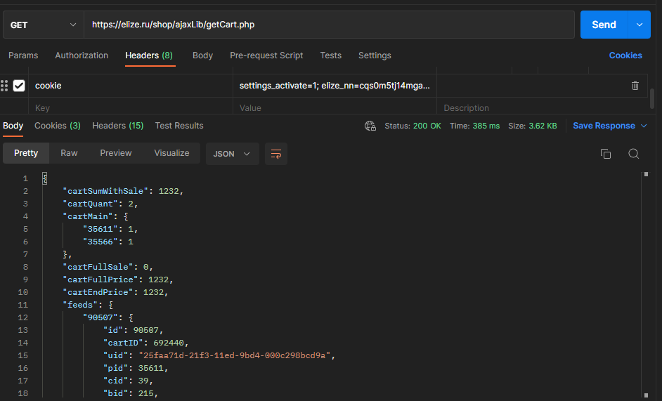

# QA_course

# Теория тестирования

## 1. Найдите 1 функциональный и 1 нефункциональный баги в работе корзины на сайте
### При удалении товара в корзине не происходит пересчет итоговой суммы заказа
__Серьезность:__ S2 

 __Приоритет:__ High

__Браузер/окружение:__ любой браузер

__Шаги воспроизведения:__
1. Добавить любой товар со страницы https://elize.
2. Перейти на страницу корзины.
3. Удалить добавленный товар из корзины.

__Ожидаемый результат:__ На странице корзины нет удаленного товара, пересчет суммы заказа. 

__Фактический результат:__ Страницы корзины пустая, сумма заказа не изменилась

### Нет возможности увеличить количество товара в корзине
__Серьезность:__ S3

__Приоритет:__ High

__Браузер/окружение:__ любой браузер

__Шаги воспроизведения:__

1. Добавить любой товар со страницы https://elize.
2. Перейти на страницу корзины.
3. Увеличить количество товара в корзине нажатием на иконку «плюс» (см.скриншот).
4. Увеличить количество товара в корзине, изменив число в поле «Количество товара» (см.скриншот)

__Ожидаемый результат:__ Увеличение количества товара в корзине

__Фактический результат:__ Количество товара в корзине не увеличивается ни одним из указанных способов.

## 2. На сайте https://elize.ru добавьте в корзину два товара и с помощью Postman получите список товаров в своей корзине. 

## 3. Составьте чек-лист для проверки формы выбора города на сайте https://elize.ru.

 1. Город успешно выбирается.
 2. Выбранный город отображается на сайте.
 3. Город можно выбрать из выпадающего меню.
 4. Город можно выбрать с помощью поиска.

## 4. Составьте тест-кейс на любой функционал на сайте https://elize.ru по своему выбору. 
### Проверка поиска товара через 

Предусловие: Перейти на сайт https://elize.ru. 

|  №|  Шаг                          | Ожидаемый результат         |
|---|-------------------------------|-----------------------------|
| 1 | В поле поиска товара ввести  артикул товара.   |  Отображается искомый товар.|
| 2 | В поле ввода товара ввести    | Отображается список товаров  с введенным наименованием товара   |

## 5. На сайте http://bugred.ru/calc/ в блоке “Анкета” найдите такой функционал, который следует тестировать с применением следующих техник тест-дизайна.

__a. Классы эквивалентности:__ 
          Поле «Как вас зовут?»
1. Ввод корректного имени (например, «Анастасия»);
2. Ввод символов латиницы и кириллицы.
3. Ввод цифры
4. Ввод специальные символы

      __Поле «Сколько вам лет?»__
6. В поле «Сколько вам лет?» ввести отрицательные числа?
7. Проверить можно ли ввести что-то кроме цифр в поле «Сколько вам лет?».
8. В поле «Сколько вам лет?» вводятся специальные символы?

__b. Граничные значения:__
  1. Ввод максимально возможного количества символов (10 символов)
   
## 6.. По сайту http://bugred.ru/calc/ составьте чек-лист для проверки негативных кейсов подсчета итоговой суммы в обоих калькуляторах. По требованиям калькуляторы принимают дробные и целые числа до 1 млн. В случае ошибки вычислений калькулятор должен показать NaN.

__Подсчет итоговой суммой в калькуляторе__

1. Подсчет итоговой суммы при вводе числа больше 1 млн.
2. Подсчет итоговой суммы при вводе отрицательного числа.
3. Ввод дробного числа через запятую.
4. Ввод дробного числа через точку.
5. Ввод специальных символов результат.
6. Ввод букв результат.
7. Ввод текста с пробелом.
8. При вводе вычисляемых выражений результат NaN.

## 7. По сайту https://svetoforonline.ru/ составьте тест-кейс для проверки удаления товара из корзины со страницы корзины

  ## Удаление товара из корзины со страницы корзины

Предусловие: Добавить любой товаров в корзину.

|  №|  Шаг                          | Ожидаемый результат         |
|---|-------------------------------|-----------------------------|
| 1 | Перейти на страницу корзины  |  Отображается страница корзины.
В корзине находится товар, который был добавлен.|
| 2 | Нажать на кнопку удаления товара из корзины справа от итоговой цены товара   | На странице корзины нет удаленного товара, пересчет суммы заказа. Вывод сообщение «Ваша корзина пуста…».  |

## 8. На сайте https://academybugs.com/articles/ есть функциональный баг с кнопками социальных сетей. Найдите этот баг и определите, кто должен его починить: фронтенд или бэкенд.

__При нажатии кнопки перехода на социальные сети, переход к соц. сетям не происходит.__

__Ответсвенная команда:__ фронтэнд.

## 9. На сайте https://academybugs.com/articles/ есть и другие баги. Оформите баг-репорты на один функциональный баг и на один нефункциональный.

### Отсутствует картинка в блоке «What happens when your fund runs out of money»

__Серьезность:__ S4

__Приоритет:__ Medium

__Браузер/окружение:__ любой браузер

__Шаги воспроизведения:__
1. Открытьстраницу https://academybugs.com/articles/ и
2. Проскроллить ленту до блока «What happens when your fund runs out of money».

__Ожидаемый результат:__ Наличие иллюстрации в блоке

__Фактический результат:__ Отсутствует картинка в блоке «What happens when your fund runs out of money»

### Нажатие кнопки «Read More» переводит на страницу с ошибкой

__Серьезность:__ S3

__Приоритет:__ High

__Браузер/окружение:__ любой браузер

__Шаги воспроизведения:__
1. Открыть страницуhttps://academybugs.com/articles/ 
2. нажать на кнопку «Read More» в любом из блоков.

__Ожидаемый результат:__ перевод на соответствующую страницу

__Фактический результат:__ Переход на страницу с ошибкой

