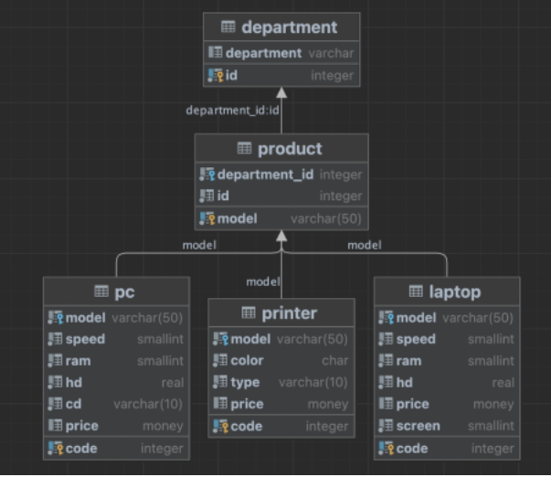
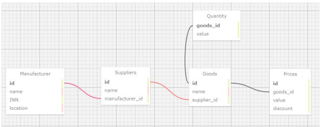

## База данных

    У компании есть БД, в которой хранятся все модели и виды техники
отделов компании. Всего в компании 5 отделов, у каждого отдела есть свой набор техники.

Схема описывает товары в магазине. 
    Основная таблица – Goods:
id – идентификатор товара
name – имя товара
supplier_id – идентификатор поставщика
    Поставщики (таблица Suppliers):
id – id поставщика
name – имя поставщика
manufacturer_id – id производителя
    Производители (таблица Manufacturer):
id – id производителя
name – имя производителя
INN – ИНН производителя
location – локация производителя
    Количество товара (таблица Quantity):
goods_id – id товара
value – количество товара
    Цена товара (таблица Prices):
id – id цены
goods_id – id товара
value – значение цены товара
discount – скидка на товар